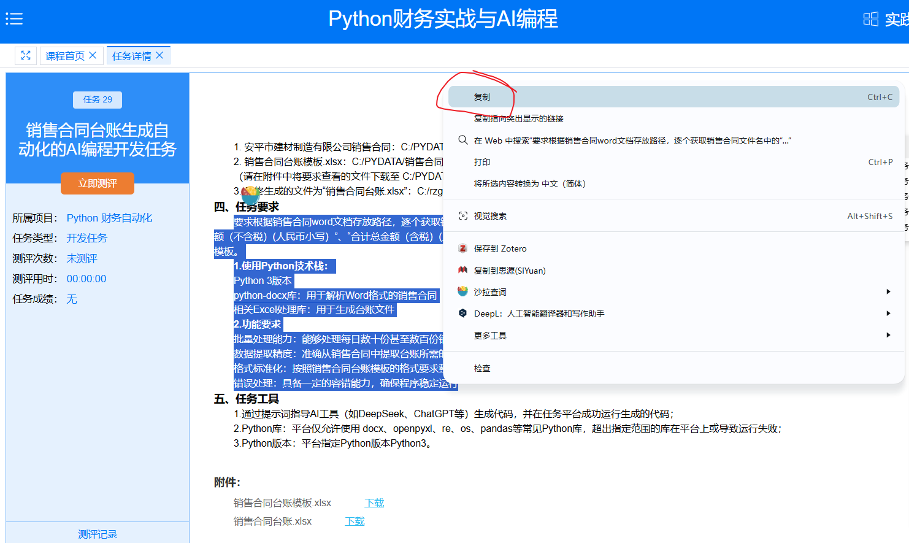
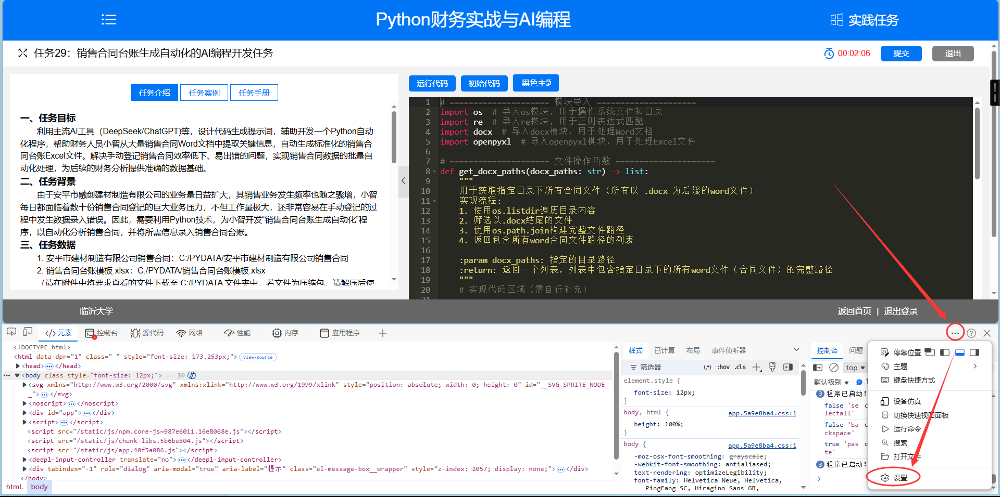
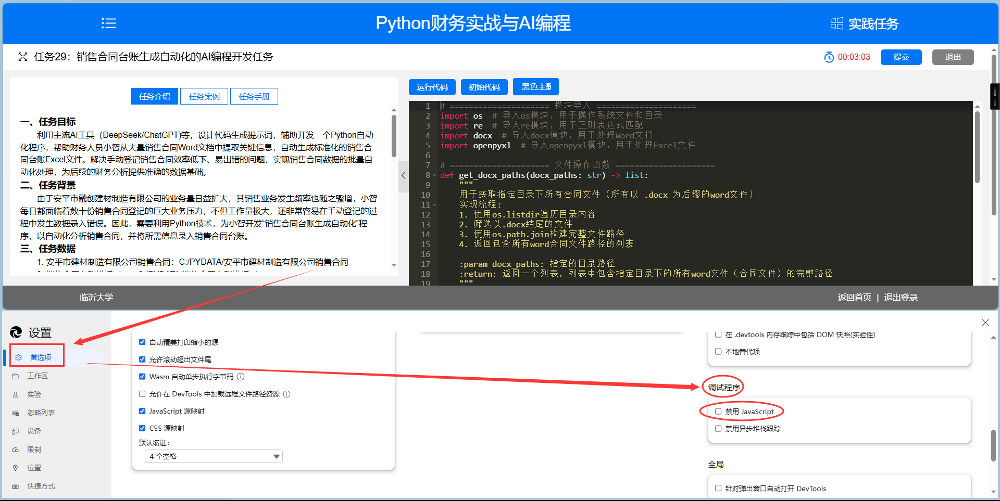
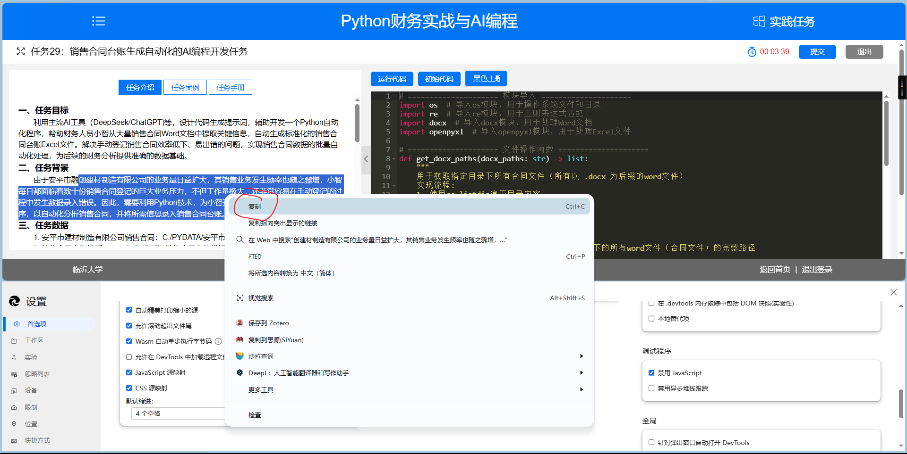
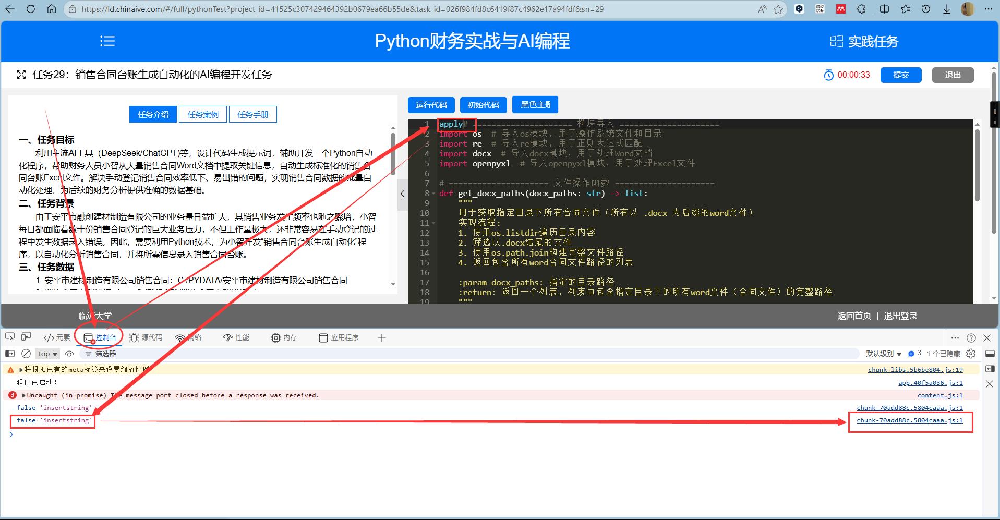
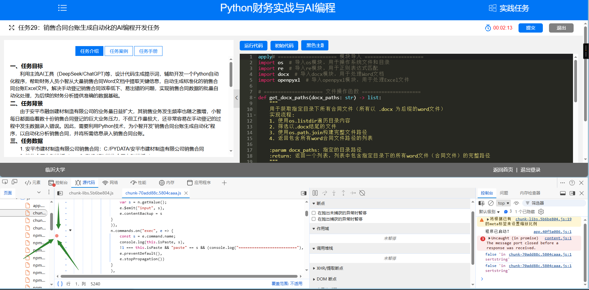
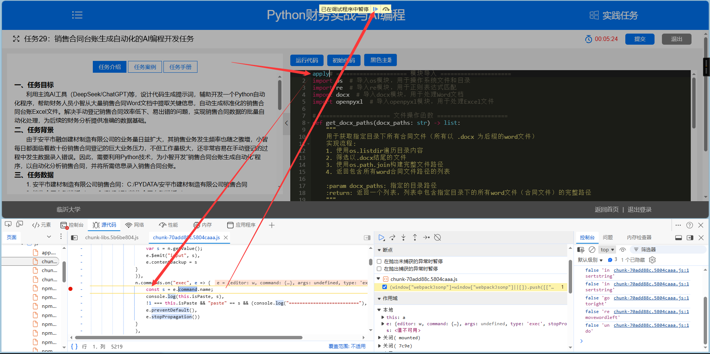
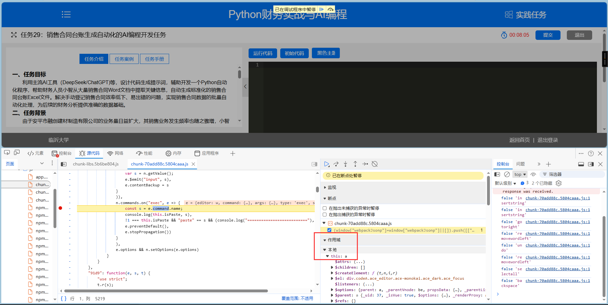
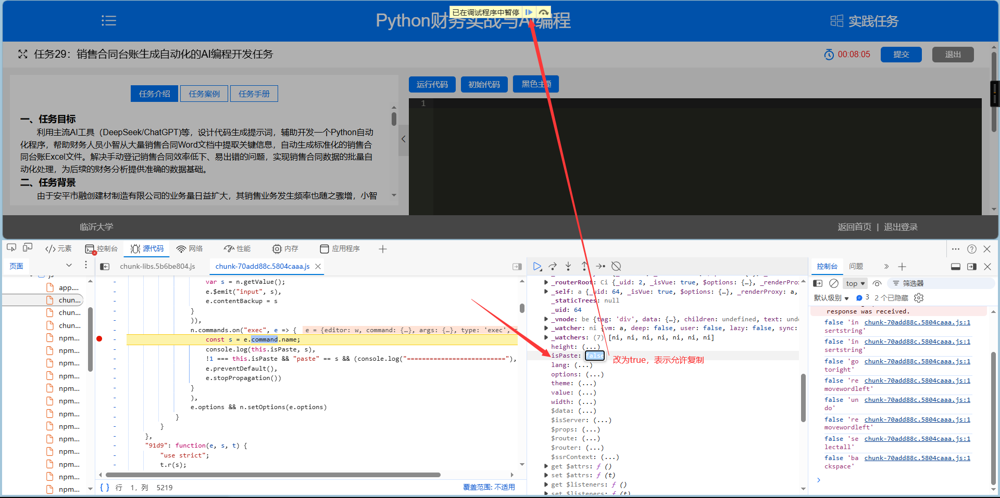
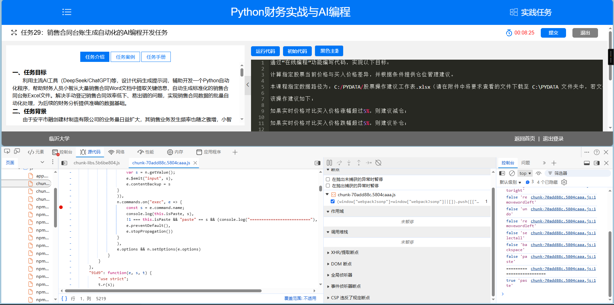

# 《Python财务实战与AI编程》系统复制粘贴
## 复制
### 方法一：打开题目，从题目复制

### 方法二：进入测评，从测评界面复制
1. 按 F12 弹出调试工具界面，并点击右上角设置

2. 首选项找到`禁用 JavaScript`，并打勾

3. 复制文本

4. 复制完后，取消勾选`禁用 JavaScript`后，界面方可正常点击。

## 粘贴
1. 按 F12 弹出调试工具界面，并切换到`控制台 (英文版为 console)`界面
2. 在编辑区域中输入任意字符会导致控制台出现记录，点击后面的蓝色高亮链接，跳转至`源代码 (英文版为 Source)`界面。

3. 注意，鼠标放到行前面会显示一个虚的红点，表示可下断点。在红点处点击，红点变实，则表示该行被下断点。继续点击实红点，红点变虚，表示断点被取消。在此处下断点。

4. 在此处下断点，后所有在编辑区域中的操作均会被暂停。由于本人执行了一个删除操作，并非预期的“粘贴”，所以点击播放按钮，让程序正常运行。

5. 然后清空编辑区域代码。如果每次点击播放太麻烦，可以先取消断点，然后清空编辑区域代码，然后下断点。
6. 粘贴。在编辑区域`右键`-`粘贴`，程序被暂停。此时，在调试区域找到 `this.a`，并展开。

7. 找到 `isPaste` 属性，点击后面省略号显示 `false`，双击 `false`，修改为 `true`，然后点击播放。

8. 粘贴成功。需要注意，每次粘贴都需要执行第7步操作。
