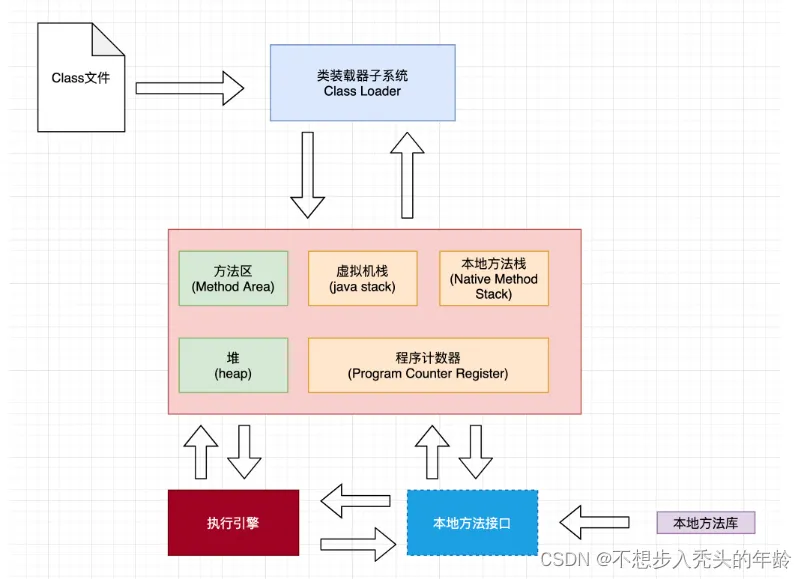
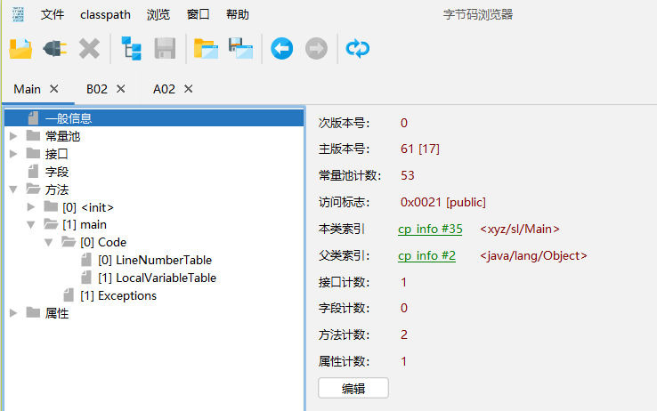
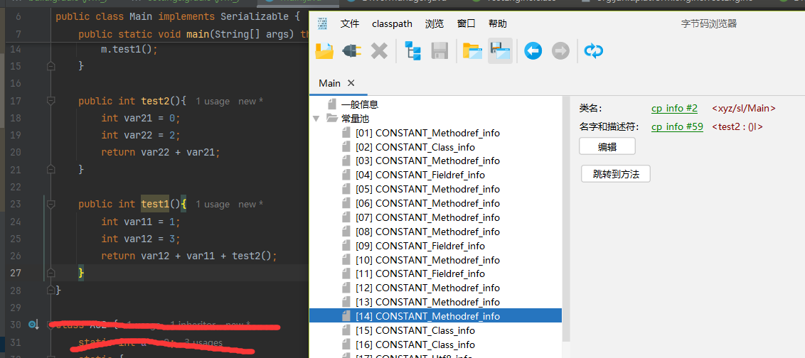
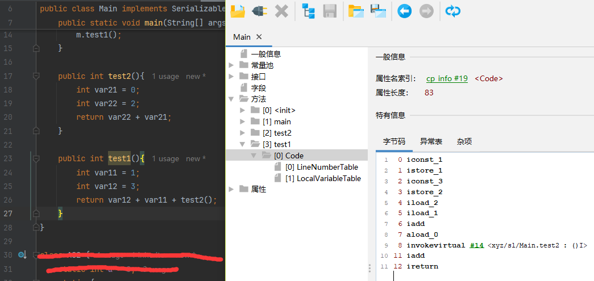

# JVM 结构

Java Virtual Machine简称为JVM，用于执行编译好的`.class`文件。

JVM由**类加载器、运行时数据区（JVM内存）、执行引擎和本地接口**四部分组成，`.class`文件的执行由这四部分共同配合完成。



**类加载器**：负责将class文件加载到JVM内存。**JVM内存**存储了所有class对象以及进程的上下文信息。**执行引擎**包括即时编译器、解释器、垃圾回收器等。**本地接口**调用本地已经编译的方法，比如虚拟机中提供的C/C++的方法。

更多JVM结构规范可以在[JVM手册](https://docs.oracle.com/javase/specs/index.html)找到详细介绍。

# Java字节码`.class`文件

字节码文件中记录了一个类的详细信息，包括主次版本号、常量池、接口、字段、方法和属性信息，通过**Jclasslib**工具可以查看。



上图中为`xyz.sl.Main`类的基本信息，主版本号61代表了Java1.7。

## 字节码文件中的常量池

 如下面图片所示，常量14记录了`test2`方法的类名（`xyz/sl/Main`）、名字（`test2`）、参数列表（`()`）和返回值（`I`）。`Methodref_info`常量并不直接记录这些字符串，而是记录这些字符串的引用 **cp info #2** 和 **cp info #59** 。
 
>注意：**cp info #2** 和 **cp info #59** 也并非字符串引用，实际上是fen'bie指向`Class_info`和`NameAndType_info`。同`Methodref_info`一样，它们内部也是**cp  info \#xx**，但最终这些引用指向字符串常量`Utf8_info`。

```alert type=note
字符串记录信息的格式同安卓smali大同小异，每个信息常量分解方法也同dexlib2工具相似。
```


回到图片，查看编辑器14行，调用`test1()`，`test1()`调用`test2()`，所以在字节码文件中的字符串常量中可以找到他们的`Methodref_info`和`Utf8_info`。但是main方法中没有调用`test1()`，或者`test1()`中没有调用`test2()`，那么它们就不会出现在常量池中。第一种情况，两者都不会出现；第二种情况，`test2`不会出现。

## 字节码文件中的方法

如图可以看到`test1()`方法体对应的字节码，有点类似与汇编语言。**iconst_1**、**istore_1**等均是虚拟机指令，所有这11行指令，完全对应了`test1()`中的三行Java代码。指令的意思在JVM内存小节中解释。


和JVM结构一样，JVM指令也由规范文件给出，可以在[JVM指令规范](https://docs.oracle.com/javase/specs/jls/se8/html/index.html)文件中查询。