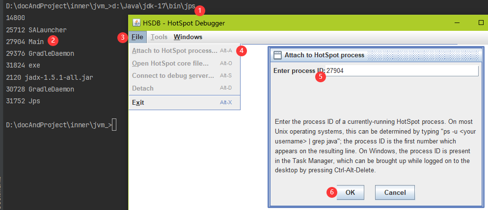

# 类的加载和类的加载器ClassLoader

## 类的生命周期


1. 加载阶段（Loading）：**类加载器**将类的字节码文件（.class文件）加载到JVM内存中。
	- 通过类的全限定名获取类的二进制字节流，包括从本地加载、从网络加载、动态代理生成
	- 将字节流所代表的类结构保存到方法区
	- 在方法区中生成一个代表该类的`InstanceKlass`，保存了类的信息的C++对象
	- 在堆中生成`java.lang.Class`对象与`InstanceKlass`相关联，在Java代码中获取类的信息以及存储静态字段的数据。

```alert type=note
- InstanceKlass在方法区，通常Java代码无法直接访问，从而控制开发者访问数据的范围，可以使用HSDB查看。它向Class类暴露了方法，可以使用Class的反射访问到InstanceKlass的部分数据。
- HSDB：JDK8使用java -cp sa-jdi.jar sun.jvm.hotspot.HSDB ; JDK17使用JAVA_HOME\bin目录下的jhsdb
- 静态字段：JDK8之前静态字段全部储存在方法区，8之后部分存储在堆区。
```

2. 验证（Verification）：确保被加载的类的正确性。 
	- 文件格式验证、元数据验证、字节码验证（魔数、版本号；语义分析，如是否有父类、是否继承final类等；数据流和控制流分析）    
    - 符号引用验证（解析阶段发生，检查引用的类、字段、方法是否存在）

3. 准备（Preparation）：为类的静态变量分配内存并设置初始值。
    - 为类变量（static变量）分配内存，并设置默认初始值（如int为`0`，引用为`null`等）
	- 注意：final static变量在此阶段会直接赋值为代码中指定的值

4. 解析（Resolution）：将符号引用（`cp info \#xx`）转换为指向内存的直接引用（形如`@0x000000007e0000c0`）。
	- 类、接口、字段、方法的解析
	- 解析可以在初始化之后进行（Java语言的动态绑定特性）

>连接（Linking）：连接包含验证、准备、初始化三个阶段。连接阶段不会执行程序员写得代码。

 5. 初始化（Initialization）：执行类`<clinit>()`方法，真正初始化类变量和其他资源。
	- `<cinit>()`执行静态变量赋值语句；执行静态代码块（即Java中的`static{}`）
	- 父类的`<clinit>()`先于子类执行
	- 线程安全，多个线程同时初始化一个类时只有一个线程能执行

```alert type=note
- `<cinit>()`先执行赋值语句还是先执行代码块和java代码中编写的顺序一致，所以为保证先赋值再执行代码块，需要将所有的 `static Object varX = new Object` 放到类声明紧接的下一行。
- 调用 `Class.forName(String)` 、访问类的静态变量、new一个对象或者执行Main方法的类四种情况会触发初始化阶段。注意变量被final修饰且等号右边是常量，不会触发初始化，因为在3阶段变量已经被赋值。
```

5. 使用（Using）：程序正常使用类。
6. 卸载（Unloading）：垃圾回收器回收类。


## 类加载器

类加载器是Java虚拟机提供给程序去实现获取类和接口字节码是数据的技术，这也意味着类加载器不止可以使用Java编写。类加载器只参与了第一个阶段的第一个步骤，获取字节码文件。

类加载器的应用场景：SPI机制、类的热部署、Tomcat类的隔离、Arthas。

类加载器分为虚拟机底层用C++实现的启动类加载器和JDK默认提供的Java编写的扩展类加载器和应用程序类加载器。

```alert type=warning
本篇所描述的类加载器环境是JDK8及之前版本，JDK8之后的版本不适用。
```

### 启动类加载器 Bootstrap ClassLoader

由Hotspot虚拟机提供的、使用C++编写的类加载器。默认加载 `JAVA_HOME/jre/lib`下的类文件，比如rt.jar、tools.jar、resources.jar。

使用`getClassLoader()`方法获取启动类加载器返回`null`，说明了启动类加载器不会被程序员直接使用。如果想使用启动类加载器加载用户jar方法有两个：
- 将用户的jar放入`jre/lib`目录中
- 使用 `-Xbootclasspath/a:jar包目录/jar包名` 虚拟机参数（推荐）

### 扩展类加载器 Extension ClassLoader

扩展类加载器由JDK提供使用Java编写的类加载器，默认加载`JAVA_HOME/jre/lib/ext`目录下的类文件。扩展类加载器加载用户jar的方法：
- 将用户jar放入`jre/lib/ext`目录
- 使用 `-Djava.ext.dirs=jar`包目录 虚拟机参数（推荐），这种方式会覆盖原始扩展目录，多个目录使用`;`（或者`:`）隔开

### 应用程序类加载器 Application ClassLoader

加载classpath下的类文件，包括项目文件和项目使用的第三方依赖文件，即运行的程序通常由应用程序类加载器加载。

图中展示了扩展类加载器和应用程序类加载器的继承关系。


## 实操：记录父类与子类的初始化

现有如下代码：

```java
package xyz.sl;

public class Main {  
    public static void main(String[] args) throws IOException { 
	    // new B02();  // new一个B02对象
        System.out.println(B02.a);  
        System.in.read();  
    }  
}  
  
class A02 {  
    static int a = 0;  
    static {  
        a = 1;  
    }  
}  
  
class B02 extends A02{  
    static {  
        a = 2;  
    }  
}
```

子类`B02`的初始化需要先初始化父类`A02`，因此`A02.a`的值被赋值为1。因为main方法没有触发`B02`的初始化，所以`B02.a`不会被赋值为2，所以最终程序输出结果为1。但若取消代码中的注释，`new B02()`触发`B02`的初始化，a被赋值为2，最终会输出2。

1. 首先来看没有取消注释的情况。打开Jclasslib加载编译生成的Main.class文件，查看main方法的指令。第二行可以看到是 `getstatic \#13 <xyz/sl/B02.a : I>`。 

   接下来运行main方法，然后再cmd中使用jps命令查看刚刚运行的Main程序的Pid（jps命令和java命令在同一个文件夹下面）。然后打开HSDB窗口，点击File->Attach to HotSpot->输入刚才得到的Pid->点击确定。在HSDB中呈现给我们的就是Main进程在JVM内存中的字节码。Attach成功之后，点击Tools->Class Browser->输入包名并点击回车。
   
   
   点击Main所在的class引用，再点击main()所在的方法引用，现在呈现的就是java程序实际执行的保存在JVM内存的代码。在第二行能明显看到该处与字节码文件中不一致，也就意味着实际执行的指令是 `getstatic #13 \[Field int a\] of class xyz.sl.A02 @0x000001229d000a00` 。也就是说虽然代码中通过`B02.a`访问，实际加载到内存的引用是`A02.a`。
   

2. 当取消掉注释，`new B02()`触发了新对象的创建。导致`B02`中的静态代码块被执行，最终输出2。
