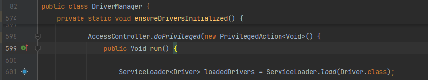
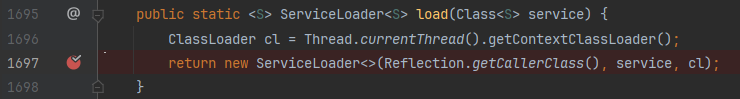

# Java服务发现机制（SPI）与线程上下文加载器

Java SPI（Service Provider Interface）是Java提供的一种服务发现机制，允许第三方为某个接口或类库提供实现。SPI的核心在于`java.util.ServiceLoader`类，它允许在运行时查找和加载服务的实现。

一般理解是：专门提供给服务提供者或者扩展框架功能的开发者去使用的一个接口。常见的使用场合：Spring框架、数据库加载驱动、日志接口、Dubbo的扩展实现。

## SPI配置方法

1. 接口定义：定义一个接口类以供外部实现。
2. 实现接口、配置服务：你需要将接口的实现类打包到Jar中，并在Jar的**META-INF/services**目录下创建一个配置文件。文件名是接口的全限定名，文件内容是实现类的全限定名，多个实现类用换行隔开。
3. 服务使用：将Jar放到主程序的classpath中，在主程序中调用`java.util.ServiceLoader.load(interface, classLoader)`初始化实现类。

## 线程上下文加载器

SPI接口均由Java核心库来提供，而实现类代码在第三方Jar包里面，所以问题就来了：
SPI接口中的代码需要加载实现类，但SPI接口是`Bootstrap`来加载。通常启动类加载器无法加载classpath中的类，也就是说Jar中的实现类无法被加载。而实现类在类路径由AppClassLoader来加载，所以SPI获取线程上下文加载器（通常为`Application`），然后使用线程上下文加载器加载驱动的实现类。

## JDBC驱动加载过程

```java
Connection conn = java.sql.DriverManager.getConnection("jdbc:mysql://localhost:3306/t_sql", "name", "password");
```

上面语句用于加载创建MySQL连接，在创建连接的时候，`DriverManager`会通过SPI机制加载JDBC驱动。

```java
// 上面一行代码的栈回溯 AccessController可以看成Thread类，在人眼查看栈回溯中可以跳过
load:1697, ServiceLoader (java.util)  // 获取线程上下文加载器，然后使用线程上下文加载实现类
run:601, DriverManager$2 (java.sql)   // SPI机制加载java.sql.Driver.class的实现类
run:598, DriverManager$2 (java.sql)  
// executePrivileged:776, AccessController (java.security)
// doPrivileged:318, AccessController (java.security)
ensureDriversInitialized:598, DriverManager (java.sql)  // 初始化所有数据库驱动
getConnection:669, DriverManager (java.sql)  // 从mysql数据库驱动中创建连接
getConnection:229, DriverManager (java.sql)  // 将name和password字符串打包
main:19, Main (xyz.sl)
```

ServiceLoader加载Driver实现类：


ServiceLoader获取线程上下文类加载器`cl`，然后加载实现类：
