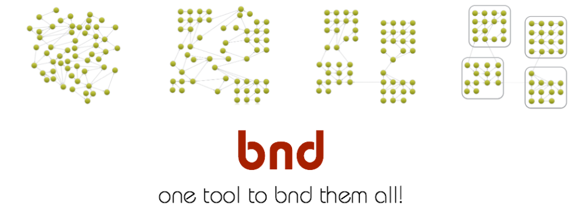
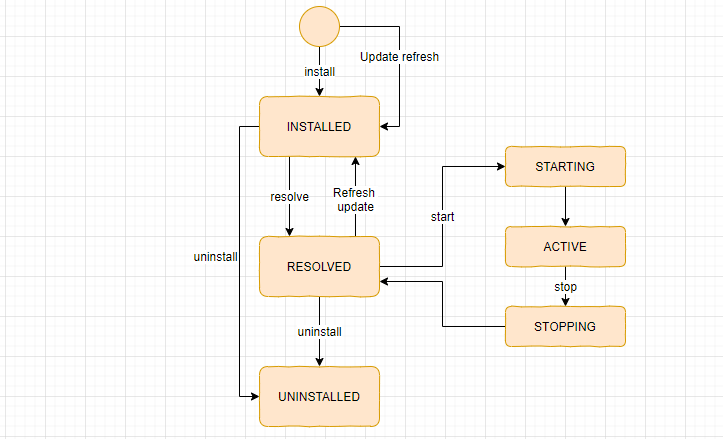
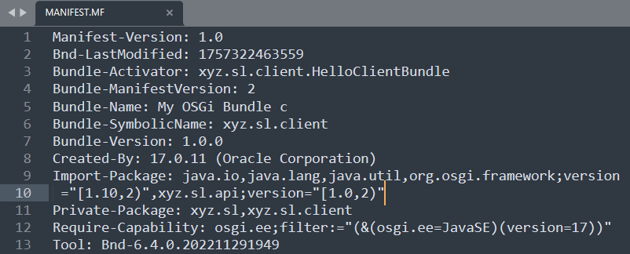
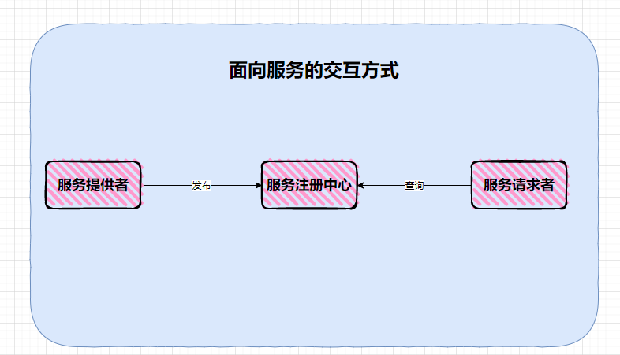
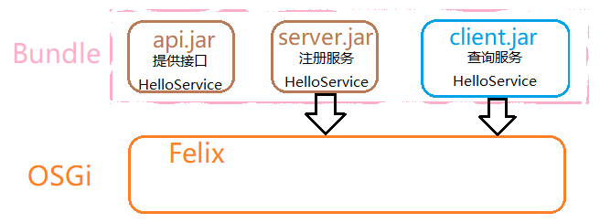
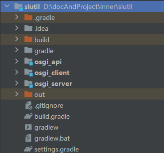
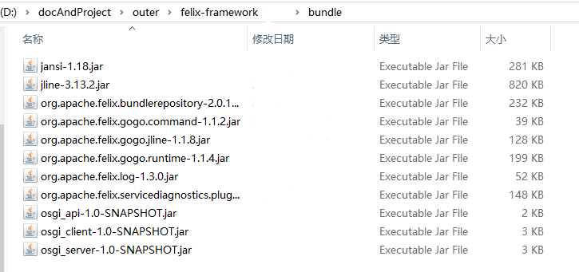
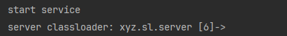
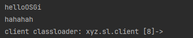

# OSGi和热部署

## OSGi - Open Service Gateway Initiative

**OSGi**（开放服务网关协议，Open Service Gateway Initiative）是一套用于Java的动态模块化系统规范。

Bnd项目开头就给出了非常形象的图片，图中每个点代表一个类，连线表示调用关系，将每个功能按调用关系归类最终得到最右边的图。所有小点被方框包裹，组成一个Bundle（模块），Bundle之间互相调用。


确切来说，每个Bundle其实就是Jar包，连线连到其它Jar包也就代表了Jar之间互相依赖的关系。例如，项目spring-context依赖spring-aop、spring-bean、spring-core等，而spring-aop依赖spring-core、和spring-bean。如此，Bundle就有了类似spring这种拆分包的优点。

与普通拆分包不同的是，OSGi还能：
- **模块化部署**：支持以模块化的方式动态部署系统，增加、扩展或改变系统功能。
- **动态扩展**：通过面向服务的组件模型和扩展点方法，实现模块的动态扩展。
- **稳定性和高效性**：采用微核机制，保证系统的稳定性，不会因为单个Bundle的崩溃而导致整个系统崩溃。

上述有点很大一部分来自于其类加载机制。OSGi中，不同的Bundle由不同的类加载器加载。

### OSGi Framework

OSGi只是一个概念，实现框架有Felix、Equinox、Concierge、Knopflerfish等。它们提供了一个平台，供Bundle运行。有点类似于Tomcat提供Web访问平台，供WebApplication运行。同样，OSGi为每个Bundle使用不同的类加载器。

### Bundle （模块）

一个Bundle就是一个模块。Bundle由OSGi框架加载/卸载。从加载到卸载需要经历以下周期：


此外每个Bundle还必须通过MANIFEST.MF文件指定导入和导出类等属性。一个Bundle的MF文件可以如图所示，它由编辑器自动生成。


### 服务注册机制

OSGi的服务注册机制如图所示，服务注册者可以在OSGi上注册服务，调用者在OSGi平台查找服务。


## OSGi 项目示例

机器环境：Win10、Java17、Gradle8.5、Felix7.0.5

服务机制草图：


创建Gradle项目，分别添加`osgi_api`、`osgi_server`、`osgi_client`三个子模块。


接着添加osgi依赖，在子模块的build脚本中添加依赖
```groovy
compileOnly 'org.osgi:osgi.core:8.0.0'
```
为了自动生成MF文件，添加Bnd的插件，在子模块的build脚本添加插件
```groovy
plugins {  
    id 'java'  
    id 'biz.aQute.bnd.builder' version '6.4.0'  
}
```
然后编写程序。

在api模块中，添加代码
```java
// IHelloService.java
package xyz.sl.api;  
  
public interface IHelloService {  
    String hello(String name);  
}
```

在Server模块中添加代码
```java
// HelloServerBundle.java
package xyz.sl.server;  
  
import org.osgi.framework.BundleActivator;  
import org.osgi.framework.BundleContext;  
import xyz.sl.api.IHelloService;  
  
import java.util.Dictionary;  
import java.util.Hashtable;  
  
public class HelloServerBundle implements BundleActivator {  
    @Override  
    public void start(BundleContext bundleContext) throws Exception {  
        System.out.println("start service");  
  
        IHelloService helloService = new HelloServiceImpl();  
        Dictionary<String, Object> properties = new Hashtable<>();  
        bundleContext.registerService(IHelloService.class.getName(), helloService, properties);  
    }  
  
    @Override  
    public void stop(BundleContext bundleContext) throws Exception {  
        System.out.println("stop service");  
    }  
}

// HelloServerImpl.java
package xyz.sl.server;  
  
import xyz.sl.api.IHelloService;  
  
public class HelloServiceImpl implements IHelloService {  
    @Override  
    public String hello(String somebody) {  
        return "hello" + somebody;  
    }  
}
```

在client模块中添加代码
```java
// HelloClientBundle.java
package xyz.sl.client;  
  
import org.osgi.framework.BundleActivator;  
import org.osgi.framework.BundleContext;  
import org.osgi.framework.ServiceReference;  
import xyz.sl.api.IHelloService;  
  
import java.util.Objects;  
  
public class HelloClientBundle implements BundleActivator {  
    @Override  
    public void start(BundleContext bundleContext) throws Exception {  
        ServiceReference<IHelloService> reference = bundleContext.getServiceReference(IHelloService.class);  
        if (Objects.nonNull(reference)){  
            IHelloService service = bundleContext.getService(reference);  
            if (Objects.nonNull(service)){  
                System.out.println(service.hello("OSGi"));  
                System.out.println("hahahah");  
            }  
            bundleContext.ungetService(reference);  
        }  
    }  
  
    @Override  
    public void stop(BundleContext bundleContext) throws Exception {  
        System.out.println("sstop");  
    }  
}
```

接下来为其配置MF文件，分别在子模块build所在的目录下新建文件，命名为`bnd.bnd`。自动生成MF文件时，会默认读取该文件，可以在`build.gradle`中修改。
```python
# in osgi_api
Bundle-SymbolicName: xyz.sl.api  
Bundle-Version: 1.0.0  
Export-Package: xyz.sl.api

# in osgi_server
Bundle-SymbolicName: xyz.sl.server  
Bundle-Version: 1.0.0  
Bundle-Name: My OSGi Bundle s  
Bundle-Activator: xyz.sl.server.HelloServerBundle

# in osgi_client
Bundle-SymbolicName: xyz.sl.client  
Bundle-Version: 1.0.0  
Bundle-Name: My OSGi Bundle c  
Bundle-Activator: xyz.sl.client.HelloClientBundle

# 更多配置可以参考其他资料
```

现在项目目录：
```ascii
├─gradle
│  └─wrapper
├─osgi_api
│  └─src
│      ├─main
│      │  ├─java
│      │  │  └─xyz
│      │  │      └─sl
│      │  │          └─api
│      │  └─resources
│      └─test
│          ├─java
│          └─resources
├─osgi_client
│  └─src
│      ├─main
│      │  ├─java
│      │  │  └─xyz
│      │  │      └─sl
│      │  │          └─client
│      │  └─resources
│      └─test
│          ├─java
│          └─resources
├─osgi_server
│  └─src
│      ├─main
│      │  ├─java
│      │  │  └─xyz
│      │  │      └─sl
│      │  │          └─server
│      │  └─resources
│      └─test
│          ├─java
│          └─resources
└─out # IDEA的OSGi插件自动生成目录
```

为了让项目运行在Felix平台，需要下载Felix框架，以及Felix项目中自带的Bundle。这里只下载了这些
```txt
felix-framework-7.0.5.zip （Felix框架须解压导入IDEA的OSGi插件）
org.apache.felix.log-1.3.0.jar （显示日志输出，放到felix-framework-7.0.5目录的bundle下）
```

然后，执行Gradle的`build`任务，会分别在三个模块的build目录中的libs下生成jar。这三个jar就是Bundle，将它们复制到felix-framework-7.0.5目录的bundle下（当然也可以不复制，那就需要在felix启动后执行install安装Bundle）。


最后，在IDEA中使用OSGi插件运行Felix，可以看到日志输出。

```log
DEBUG: WIRE: [org.jline [1](R 1.0)] osgi.ee; (&(osgi.ee=JavaSE)(version=1.8)) -> [org.apache.felix.framework [0](R 0)]
DEBUG: WIRE: [org.apache.felix.gogo.runtime [4](R 4.0)] osgi.wiring.package; (&(osgi.wiring.package=org.osgi.framework)(version>=1.8.0)(!(version>=2.0.0))) -> [org.apache.felix.framework [0](R 0)]
DEBUG: WIRE: [org.apache.felix.gogo.runtime [4](R 4.0)] osgi.wiring.package; (&(osgi.wiring.package=org.osgi.util.tracker)(version>=1.5.0)(!(version>=2.0.0))) -> [org.apache.felix.framework [0](R 0)]
DEBUG: WIRE: [org.apache.felix.gogo.runtime [4](R 4.0)] osgi.ee; (&(osgi.ee=JavaSE)(version=1.7)) -> [org.apache.felix.framework [0](R 0)]
DEBUG: WIRE: [org.apache.felix.gogo.command [2](R 2.0)] osgi.wiring.package; (&(osgi.wiring.package=org.apache.felix.service.command)(version>=1.0.0)(!(version>=2.0.0))) -> [org.apache.felix.gogo.runtime [4](R 4.0)]
DEBUG: WIRE: [org.apache.felix.gogo.command [2](R 2.0)] osgi.wiring.package; (&(osgi.wiring.package=org.osgi.framework)(version>=1.8.0)(!(version>=2.0.0))) -> [org.apache.felix.framework [0](R 0)]
DEBUG: WIRE: [org.apache.felix.gogo.command [2](R 2.0)] osgi.wiring.package; (&(osgi.wiring.package=org.osgi.framework.startlevel)(version>=1.0.0)(!(version>=2.0.0))) -> [org.apache.felix.framework [0](R 0)]
DEBUG: WIRE: [org.apache.felix.gogo.command [2](R 2.0)] osgi.wiring.package; (&(osgi.wiring.package=org.osgi.framework.wiring)(version>=1.2.0)(!(version>=2.0.0))) -> [org.apache.felix.framework [0](R 0)]
DEBUG: WIRE: [org.apache.felix.gogo.command [2](R 2.0)] osgi.ee; (&(osgi.ee=JavaSE)(version=1.7)) -> [org.apache.felix.framework [0](R 0)]
DEBUG: WIRE: [org.apache.felix.gogo.jline [3](R 3.0)] osgi.wiring.package; (&(osgi.wiring.package=org.jline.builtins)(version>=3.13.0)(!(version>=4.0.0))) -> [org.jline [1](R 1.0)]
DEBUG: WIRE: [org.apache.felix.gogo.jline [3](R 3.0)] osgi.wiring.package; (&(osgi.wiring.package=org.jline.reader)(version>=3.13.0)(!(version>=4.0.0))) -> [org.jline [1](R 1.0)]
DEBUG: WIRE: [org.apache.felix.gogo.jline [3](R 3.0)] osgi.wiring.package; (&(osgi.wiring.package=org.jline.reader.impl)(version>=3.13.0)(!(version>=4.0.0))) -> [org.jline [1](R 1.0)]
DEBUG: WIRE: [org.apache.felix.gogo.jline [3](R 3.0)] osgi.wiring.package; (&(osgi.wiring.package=org.jline.terminal)(version>=3.13.0)(!(version>=4.0.0))) -> [org.jline [1](R 1.0)]
DEBUG: WIRE: [org.apache.felix.gogo.jline [3](R 3.0)] osgi.wiring.package; (&(osgi.wiring.package=org.jline.utils)(version>=3.13.0)(!(version>=4.0.0))) -> [org.jline [1](R 1.0)]
DEBUG: WIRE: [org.apache.felix.gogo.jline [3](R 3.0)] osgi.wiring.package; (&(osgi.wiring.package=org.apache.felix.gogo.runtime)(version>=1.1.0)(!(version>=2.0.0))) -> [org.apache.felix.gogo.runtime [4](R 4.0)]
DEBUG: WIRE: [org.apache.felix.gogo.jline [3](R 3.0)] osgi.wiring.package; (&(osgi.wiring.package=org.apache.felix.service.command)(version>=1.0.0)(!(version>=2.0.0))) -> [org.apache.felix.gogo.runtime [4](R 4.0)]
DEBUG: WIRE: [org.apache.felix.gogo.jline [3](R 3.0)] osgi.wiring.package; (&(osgi.wiring.package=org.apache.felix.service.threadio)(version>=1.0.0)(!(version>=2.0.0))) -> [org.apache.felix.gogo.runtime [4](R 4.0)]
DEBUG: WIRE: [org.apache.felix.gogo.jline [3](R 3.0)] osgi.wiring.package; (&(osgi.wiring.package=org.osgi.framework)(version>=1.8.0)(!(version>=2.0.0))) -> [org.apache.felix.framework [0](R 0)]
DEBUG: WIRE: [org.apache.felix.gogo.jline [3](R 3.0)] osgi.wiring.package; (&(osgi.wiring.package=org.osgi.framework.startlevel)(version>=1.0.0)(!(version>=2.0.0))) -> [org.apache.felix.framework [0](R 0)]
DEBUG: WIRE: [org.apache.felix.gogo.jline [3](R 3.0)] osgi.ee; (&(osgi.ee=JavaSE)(version=1.8)) -> [org.apache.felix.framework [0](R 0)]
DEBUG: WIRE: [xyz.sl.api [5](R 5.0)] osgi.ee; (&(osgi.ee=JavaSE)(version=17)) -> [org.apache.felix.framework [0](R 0)]
DEBUG: WIRE: [xyz.sl.server [6](R 6.0)] osgi.wiring.package; (osgi.wiring.package=java.io) -> [org.apache.felix.framework [0](R 0)]
DEBUG: WIRE: [xyz.sl.server [6](R 6.0)] osgi.wiring.package; (osgi.wiring.package=java.lang) -> [org.apache.felix.framework [0](R 0)]
DEBUG: WIRE: [xyz.sl.server [6](R 6.0)] osgi.wiring.package; (osgi.wiring.package=java.lang.invoke) -> [org.apache.felix.framework [0](R 0)]
DEBUG: WIRE: [xyz.sl.server [6](R 6.0)] osgi.wiring.package; (osgi.wiring.package=java.util) -> [org.apache.felix.framework [0](R 0)]
DEBUG: WIRE: [xyz.sl.server [6](R 6.0)] osgi.wiring.package; (&(osgi.wiring.package=org.osgi.framework)(version>=1.10.0)(!(version>=2.0.0))) -> [org.apache.felix.framework [0](R 0)]
DEBUG: WIRE: [xyz.sl.server [6](R 6.0)] osgi.wiring.package; (&(osgi.wiring.package=xyz.sl.api)(version>=1.0.0)(!(version>=2.0.0))) -> [xyz.sl.api [5](R 5.0)]
DEBUG: WIRE: [xyz.sl.server [6](R 6.0)] osgi.ee; (&(osgi.ee=JavaSE)(version=17)) -> [org.apache.felix.framework [0](R 0)]
start service
DEBUG: WIRE: [org.apache.felix.servicediagnostics.plugin [7](R 7.0)] osgi.wiring.package; (&(osgi.wiring.package=org.osgi.framework)(version>=1.5.0)(!(version>=2.0.0))) -> [org.apache.felix.framework [0](R 0)]
ERROR: Bundle org.apache.felix.servicediagnostics.plugin [7] Error starting file:/D:/docAndProject/outer/felix-framework-7.0.5/bundle/org.apache.felix.servicediagnostics.plugin-0.1.3.jar (org.osgi.framework.BundleException: Activator start error in bundle org.apache.felix.servicediagnostics.plugin [7].)
DEBUG: WIRE: [xyz.sl.client [8](R 8.0)] osgi.wiring.package; (osgi.wiring.package=java.io) -> [org.apache.felix.framework [0](R 0)]
DEBUG: WIRE: [xyz.sl.client [8](R 8.0)] osgi.wiring.package; (osgi.wiring.package=java.lang) -> [org.apache.felix.framework [0](R 0)]
DEBUG: WIRE: [xyz.sl.client [8](R 8.0)] osgi.wiring.package; (osgi.wiring.package=java.util) -> [org.apache.felix.framework [0](R 0)]
DEBUG: WIRE: [xyz.sl.client [8](R 8.0)] osgi.wiring.package; (&(osgi.wiring.package=org.osgi.framework)(version>=1.10.0)(!(version>=2.0.0))) -> [org.apache.felix.framework [0](R 0)]
DEBUG: WIRE: [xyz.sl.client [8](R 8.0)] osgi.wiring.package; (&(osgi.wiring.package=xyz.sl.api)(version>=1.0.0)(!(version>=2.0.0))) -> [xyz.sl.api [5](R 5.0)]
DEBUG: WIRE: [xyz.sl.client [8](R 8.0)] osgi.ee; (&(osgi.ee=JavaSE)(version=17)) -> [org.apache.felix.framework [0](R 0)]
helloOSGi
hahahah
DEBUG: WIRE: [org.apache.felix.log [9](R 9.0)] osgi.wiring.package; (&(osgi.wiring.package=org.osgi.framework)(version>=1.8.0)(!(version>=2.0.0))) -> [org.apache.felix.framework [0](R 0)]
DEBUG: WIRE: [org.apache.felix.log [9](R 9.0)] osgi.wiring.package; (&(osgi.wiring.package=org.osgi.framework.wiring)(version>=1.2.0)(!(version>=2.0.0))) -> [org.apache.felix.framework [0](R 0)]
DEBUG: WIRE: [org.apache.felix.log [9](R 9.0)] osgi.wiring.package; (&(osgi.wiring.package=org.osgi.util.tracker)(version>=1.5.0)(!(version>=2.0.0))) -> [org.apache.felix.framework [0](R 0)]
DEBUG: WIRE: [org.apache.felix.log [9](R 9.0)] osgi.ee; (&(osgi.ee=JavaSE)(version=1.8)) -> [org.apache.felix.framework [0](R 0)]

____________________________
Welcome to Apache Felix Gogo

DEBUG: Bundle org.apache.felix.gogo.jline [3] ext/gosh_profile not found by org.apache.felix.gogo.jline [3]
g! lb
START LEVEL 1
   ID|State      |Level|Name
    0|Active     |    0|System Bundle (7.0.5)|7.0.5
    1|Active     |    1|JLine Bundle (3.13.2)|3.13.2
    2|Active     |    1|Apache Felix Gogo Command (1.1.2)|1.1.2
    3|Active     |    1|Apache Felix Gogo JLine Shell (1.1.8)|1.1.8
    4|Active     |    1|Apache Felix Gogo Runtime (1.1.4)|1.1.4
    5|Active     |    1|xyz.sl.api (1.0.0)|1.0.0
    6|Active     |    1|My OSGi Bundle s (1.0.0)|1.0.0
    7|Resolved   |    1|Apache Felix Web Console Service Diagnostics Plugin (0.1.3)|0.1.3
    8|Active     |    1|My OSGi Bundle c (1.0.0)|1.0.0
    9|Active     |    1|Apache Felix Log Service (1.3.0)|1.3.0

```

服务端的Bundle和客户端的Bundle的类加载器分别是



## 热部署

以上并未为OSGi设置监听器，所以说只算是静态部署。OSGi优势在于Bundle热插拔、动态更新等特点。

OSGi的用处在于“模块化”和“热插拔”。模块化包括模块化、版本化和面向服务的设计。热插拔也就是说模块/Bundle的热插拔，它可以实现更新和升级模块/Bundle（即系统的一部分）而无需重启整个系统。

如果你的系统套用了OSGi架构，Bundle的相互依赖关系复杂，又没有Bundle动态加载、动态更新、动态卸载和动态监听的机制，都是静态启动所有Bundle，那就是为了OSGi架构而OSGi架构，把问题复杂化了。其代价也是很大的，因为原来你的jar包用**Maven/Gradle**来处理依赖关系和自动更新也很方便，而由于整个系统建立在OSGi规范上，你的应用所依赖的其他组件也“不得不”迁移到OSGi上来，再加上OSGi独特的ClassLoader设计，使Bundle间的类互相访问受到一定的约束，一切都需要迁移到OSGi的约束上来。

举个例子来说，就像Eclipse提供了动态加载、更新和删除插件的机制，因为它里面有一个插件注册和反注册的接口和插件加载、更新和删除的监听线程，这样允许你动态加载、更新和删除Eclipse插件而无需重启Eclipse。当然，如果你当前进程调用了某插件，比如js语法高亮，而某插件更新了，那么当前的js实例还是需要重新打开的。但整个Eclispe无需重启。

参考：[OSGi热部署优点](https://www.jianshu.com/p/5406b2473157)。  