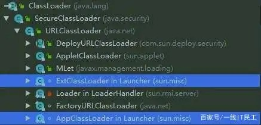

# JDK 9 前后类加载器变化

## 9 之前

JVM 中有 3 个默认的类加载器：
1. 引导（**Bootstrap**）类加载器。由原生代码（如 C 语言）编写，不继承自 `java.lang.ClassLoader` 。负责加载核心 Java 库，存储在 `<JAVA_HOME>/jre/lib` 目录中。
2. 扩展（**Extensions**）类加载器。用来在 `<JAVA_HOME>/jre/lib/ext` ,或 `java.ext.dirs` 中指明的目录中加载 Java 的扩展库。Java 虚拟机的实现会提供一个扩展库目录。该类加载器在此目录里面查找并加载 Java 类。该类由 `sun.misc.Launcher$ExtClassLoader` 实现。
3. Apps 类加载器（也称系统类加载器）。根据 Java 应用程序的类路径（java.class.path或CLASSPATH环境变量）来加载 Java 类。一般来说，Java 应用的类都是由它来完成加载的。可以通过  `ClassLoader.getSystemClassLoader()` 来获取它。该类由 `sun.misc.Launcher$AppClassLoader` 实现。

## 9 之后
为了兼容性， JDK 9 没有从本质上破坏双亲委派机制，但是对双亲外派机制的结构进了修改。

1. 扩展类机制被移除，但是为了保证向后兼容，扩展类加载器仍被保留，不被重命名为了平台类加载器（Platform Class Loader）。由于jdk9的模块化构建，原来的 rt.jar 和 tools.jar 被拆分成数十个 JMOD 文件，其中的 Java 类库就已天然地满足了可扩展的需求，那自然无须再保留 `<JAVA_HOME>\lib\ext` 目录，此前使用这个目录或者 `java.ext.dirs` 系统变量来扩展 JDK 功能的机制已经没有继续存在的价值了。
2. 平台类加载器和应用程序类加载器都不再继承自  `java.net.URLClassLoader` 。现在启动类加载器、平台类加载器、应用程序类加载器全都继承于 `jdk.internal.loader.BuiltinClassLoader` 。如果有程序直接依赖了这种继承关系，或者依赖了 `URLClassLoader` 类的特定方法，那代码很可能会在 JDK 9 及更高版本的 JDK 中崩溃。
3. 在 Java 9 中，类加载器有了名称。该名称在构造方法中指定，可以通过 `getName()` 方法来获取。平台类加载器的名称是 `platform` ，应用类加载器的名称是 `app` 。类加载器的名称在调试与类加载器相关的问题时会非常有用。
4. 启动类加载器现在是在 JVM 内部和 JAVA 类库共同协作实现的类加载器（以前是 C++ 实现），但为了与之前代码兼容，在获取启动类加载器的场景中仍然会返回 null ，而不会得到 `BootClassLoader` 实例。
5. 新版本 JDK 中同时取消了 `<JAVA_HOME>\jre` 目录，因为随时可以组合构建出程序运行所需的 JRE ，举例：只使用 java.base 模块中的类型，组合 JRE 
```shell
jlink -p $JAVA_HOME/jmods --add-modules java.base --output jre
```

## JDK 9 前后类加载器继承架构对比
之前：

之后：


更多 Jdk 版本的特性参考 [Jdk 新特性概览](https://javaguide.cn/java/new-features/java9.html)
